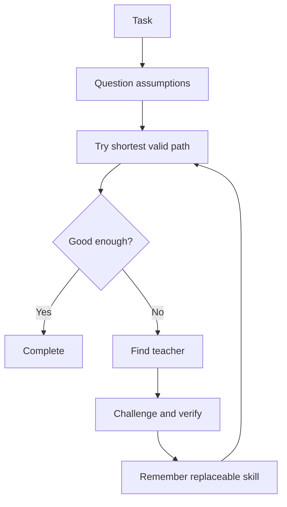

# AI-Apprentice

> Don’t build an AI that knows everything. Build one that never stops learning.

AI-Apprentice is a local-first framework for building personal AI agents that improve by learning from specialist models, tools, and real-world feedback.

Most AI projects try to ship a bigger brain. AI-Apprentice ships a learning loop:

1. Question the assumed route.
2. Try the task.
3. Notice what it cannot do well.
4. Find a teacher, tool, model, document, or example.
5. Search for counterexamples and verify the result.
6. Extract the reusable skill.
7. Store it as a replaceable rule.
8. Use it better next time.

The goal is not an AI that claims to know everything. The goal is an AI that knows how to learn.

## Why This Exists

Today, strong AI systems are everywhere, but most personal agents are still stuck in a simple pattern:

- ask a model
- get an answer
- forget the lesson
- ask again tomorrow

AI-Apprentice turns useful interactions into durable improvement. If the agent learns a translation style from one model, a research habit from another, and a debugging pattern from a third, those lessons become local skills the agent can reuse.

Think of it as an apprentice that watches, practices, writes notes, and slowly becomes more useful to one person.

## Core Idea



## What Is In This Repo

This repository is intentionally small right now. It starts with a runnable learning-loop demo and a clear project direction.

```text
ai_apprentice/
  apprentice.py      # Learning loop primitives
examples/
  translation_loop.py # Demo: learn a reusable translation style
tests/
  test_apprentice.py
docs/
  concept.md
  roadmap.md
```

## Quick Start

Requires Python 3.10+.

```bash
python examples/translation_loop.py
```

Run tests:

```bash
python -m unittest discover -s tests
```

## Demo

The first demo uses a simple translation task:

- The apprentice receives a rough English sentence.
- It tries to produce a natural Chinese version.
- If it lacks the right style, it asks a teacher.
- It extracts a reusable style rule.
- Next time, the same rule is available from memory.

This demo does not call a paid API yet. It is deliberately offline so the learning loop is easy to inspect.

## Roadmap

- Offline learning-loop prototype
- Skill memory format
- Teacher adapters for local models and API models
- Assumption challenger and counterexample verification
- Skill review, replacement, rollback, and pruning
- Shortcut search and personal agent runtime
- Browser, file, and voice/vision observation modules

See [docs/roadmap.md](docs/roadmap.md).

## Project Philosophy

AI-Apprentice is built around a few beliefs:

- Goal over process: identify the real outcome before inheriting a route.
- Every process is a temporary solution, not a permanent law.
- Every learned rule must be testable, replaceable, and reversible.
- Specialist models are teachers, not authorities or final destinations.
- Verification includes actively searching for counterexamples.
- Facts, inference, and uncertainty should remain distinguishable.
- Local memory matters because personal improvement should belong to the user.
- Small reusable skills beat one giant vague prompt.

> Intelligence is not doing more work. It is shortening the distance to the goal.

AI-Apprentice does not only learn. It questions what it learned and replaces it when a better verified path appears.

## Contributing

This project is early. Good contributions are practical and concrete:

- a better learning-loop demo
- a cleaner skill memory format
- a teacher adapter
- verification examples
- documentation that makes the idea easier to understand

See [CONTRIBUTING.md](CONTRIBUTING.md).

## Chinese

中文说明见 [README.zh-CN.md](README.zh-CN.md).

## License

MIT
