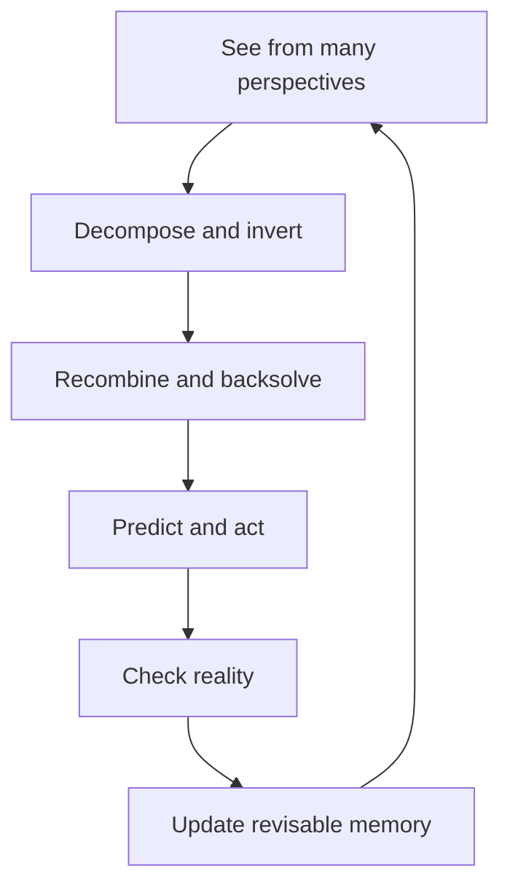

# AI-Apprentice

> Don’t build an AI that knows everything. Build one that learns from reality.

AI-Apprentice is a local-first framework for personal AI agents that improve through use. It does not treat an answer as learning. Learning happens only when a prediction meets evidence and changes memory.

## The Growth Loop



In plain language:

1. Look from the user, executor, system, designer, opposite, attacker, future, and outsider viewpoints.
2. Decompose the problem.
3. Reverse the obvious assumptions.
4. Recombine the useful pieces.
5. Work backwards from evidence of success.
6. Make a prediction and act.
7. Compare the prediction with reality.
8. Turn the difference into a revisable skill.

This is the key distinction:

> Memory is not a pile of answers. It is a history of predictions corrected by reality.

## Why This Exists

Most agents answer, forget, and repeat. Some systems store every answer and call that learning. Both miss the important part: reality may disagree.

AI-Apprentice keeps the learning process inspectable:

- `PerspectiveEngine` exposes blind spots without pretending to answer them.
- `ProblemTransformer` records decomposition, inversion, recombination, and backsolved steps.
- `ExperienceRecord` stores prediction, actual outcome, evidence, lesson, and counterexamples.
- `MemoryUpdater` changes confidence only when evidence exists and quarantines unreliable skills.
- `SkillMemory` keeps both the current rule and the experience behind it.

## Quick Start

Requires Python 3.10+ and has no external dependencies.

```bash
python examples/growth_loop.py
python -m unittest discover -s tests
```

The original offline translation demo remains available:

```bash
python examples/translation_loop.py
```

## Small Example

```python
from ai_apprentice import Apprentice, ExperienceRecord, Skill, SkillMemory

memory = SkillMemory([Skill("launch-rule", "launch", "Add more features", confidence=0.6)])
apprentice = Apprentice(memory, [])

plan = apprentice.plan(
    "Launch an open-source tool",
    goal="Help a visitor understand its value in 30 seconds",
    assumptions=("more features create more trust",),
)

apprentice.learn_from_reality(
    "launch-rule",
    ExperienceRecord(
        task=plan.frame.original_task,
        prediction="More features improve understanding",
        actual_outcome="Testers missed the core value",
        evidence=("3/3 tester summaries missed it",),
        matched=False,
        lesson="Show one verified outcome first",
    ),
)
```

Without evidence, confidence does not rise. Repeated failure can quarantine a skill so it is no longer reused.

## Project Boundaries

AI-Apprentice is not an all-knowing AI shell, a chain of models, or an automatic truth machine. The current primitives make the growth loop explicit; adapters and agents can supply the actual reasoning and real-world evidence.

AfterAI can optionally provide evidence from AI work logs, but neither project depends on the other:

> AfterAI sees what happened. AI-Apprentice learns what to change.

## Philosophy

- Goal over inherited process.
- Multiple perspectives before commitment.
- Teachers are sources, not authorities.
- No evidence, no confidence increase.
- Failed predictions are learning material, not deleted embarrassment.
- Every rule must be testable, replaceable, and reversible.
- Personal learning should remain local and inspectable.

See [docs/concept.md](docs/concept.md) and [docs/roadmap.md](docs/roadmap.md).

## Contributing

Practical contributions are welcome: real evidence adapters, failure examples, better skill-memory formats, and small demos that prove the loop works. See [CONTRIBUTING.md](CONTRIBUTING.md).

中文说明见 [README.zh-CN.md](README.zh-CN.md).

## License

MIT
