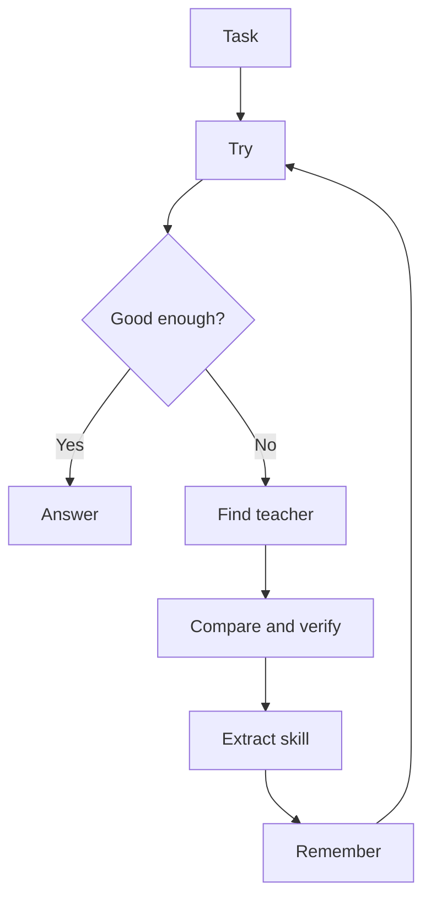

# AI-Apprentice

> Don’t build an AI that knows everything. Build one that never stops learning.

AI-Apprentice is a local-first framework for building personal AI agents that improve by learning from specialist models, tools, and real-world feedback.

Most AI projects try to ship a bigger brain. AI-Apprentice ships a learning loop:

1. Try the task.
2. Notice what it cannot do well.
3. Find a teacher, tool, model, document, or example.
4. Compare answers and verify the result.
5. Extract the reusable skill.
6. Store the skill in memory.
7. Use it better next time.

The goal is not an AI that claims to know everything. The goal is an AI that knows how to learn.

## Why This Exists

Today, strong AI systems are everywhere, but most personal agents are still stuck in a simple pattern:

- ask a model
- get an answer
- forget the lesson
- ask again tomorrow

AI-Apprentice turns useful interactions into durable improvement. If the agent learns a translation style from one model, a research habit from another, and a debugging pattern from a third, those lessons become local skills the agent can reuse.

Think of it as an apprentice that watches, practices, writes notes, and slowly becomes more useful to one person.

## Core Idea



## What Is In This Repo

This repository is intentionally small right now. It starts with a runnable learning-loop demo and a clear project direction.

```text
ai_apprentice/
  apprentice.py      # Learning loop primitives
examples/
  translation_loop.py # Demo: learn a reusable translation style
tests/
  test_apprentice.py
docs/
  concept.md
  roadmap.md
```

## Quick Start

Requires Python 3.10+.

```bash
python examples/translation_loop.py
```

Run tests:

```bash
python -m unittest discover -s tests
```

## Demo

The first demo uses a simple translation task:

- The apprentice receives a rough English sentence.
- It tries to produce a natural Chinese version.
- If it lacks the right style, it asks a teacher.
- It extracts a reusable style rule.
- Next time, the same rule is available from memory.

This demo does not call a paid API yet. It is deliberately offline so the learning loop is easy to inspect.

## Roadmap

- Offline learning-loop prototype
- Skill memory format
- Teacher adapters for local models and API models
- Verification strategies
- Skill review and pruning
- Personal agent runtime
- Browser, file, and voice/vision observation modules

See [docs/roadmap.md](docs/roadmap.md).

## Project Philosophy

AI-Apprentice is built around a few beliefs:

- A personal AI should learn from use, not reset every conversation.
- Specialist models are teachers, not final destinations.
- Local memory matters because personal improvement should belong to the user.
- Verification matters because copying an answer is not the same as learning.
- Small reusable skills beat one giant vague prompt.

## Contributing

This project is early. Good contributions are practical and concrete:

- a better learning-loop demo
- a cleaner skill memory format
- a teacher adapter
- verification examples
- documentation that makes the idea easier to understand

See [CONTRIBUTING.md](CONTRIBUTING.md).

## Chinese

中文说明见 [README.zh-CN.md](README.zh-CN.md).

## License

MIT
