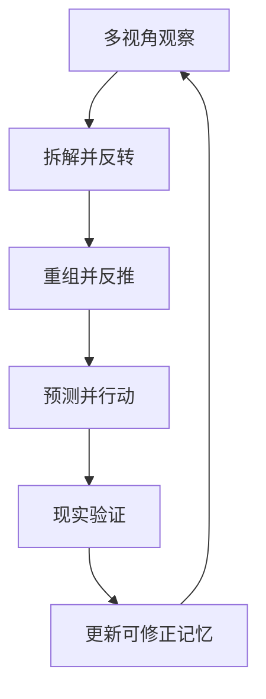

# AI-Apprentice

> 不要造一个什么都知道的 AI。造一个会从现实中成长的 AI。

AI-Apprentice 是一个本地优先的个人 AI 学徒框架。它不把“回答过”误认为“学会了”。只有当预测遇到现实证据，并因此改变记忆，成长才真正发生。

## 成长闭环



具体来说：

1. 从用户、执行者、系统、设计者、相反面、攻击者、未来和局外人视角观察。
2. 拆解问题。
3. 反转看似理所当然的假设。
4. 重组仍然有用的部分。
5. 从“什么证据代表成功”向前反推。
6. 先做出预测，再行动。
7. 用现实结果检查预测。
8. 把两者的差异写进可修正的技能记忆。

最核心的一句话：

> 记忆不是答案仓库，而是被现实不断修正的预测历史。

## 这次升级加入了什么

- `PerspectiveEngine`：上帝视角不是高高在上，而是主动切换多个有限视角，暴露盲区。
- `ProblemTransformer`：把拆解、逆向、重组、反推变成可检查的问题框架。
- `ExperienceRecord`：记录预测、实际结果、证据、差异、教训和反例。
- `MemoryUpdater`：只有存在证据时才改变置信度；持续失败的技能会被隔离。
- `SkillMemory`：不仅保存当前规则，也保存规则背后的现实经历。

## 快速运行

需要 Python 3.10+，没有第三方依赖。

```bash
python examples/growth_loop.py
python -m unittest discover -s tests
```

原有的离线翻译学习示例仍然保留：

```bash
python examples/translation_loop.py
```

## 它不是什么

AI-Apprentice 不是全能 AI 外壳，不是让多个模型轮流回答，也不是自动产生真理的机器。

当前框架只做一件重要的事：让成长过程可以观察、验证和修正。模型、工具、人类反馈或日志都可以提供推理与证据，但没有证据时，系统不能假装自己的能力提高了。

AfterAI 可以作为可选证据来源，但两个项目保持独立：

> AfterAI 看见发生了什么；AI-Apprentice 学会下次改变什么。

## 原则

- 先找真实目标，再继承流程。
- 行动前主动切换视角。
- 老师是信息源，不是权威。
- 没有证据，就不提高置信度。
- 失败预测不是污点，而是成长材料。
- 每条规则都必须可验证、可替换、可回滚。
- 个人成长记忆应该本地、透明、属于用户。

详细设计见 [docs/concept.md](docs/concept.md)，开发路线见 [docs/roadmap.md](docs/roadmap.md)。

## 开源口号

Don’t build an AI that knows everything.

Build one that learns from reality.
