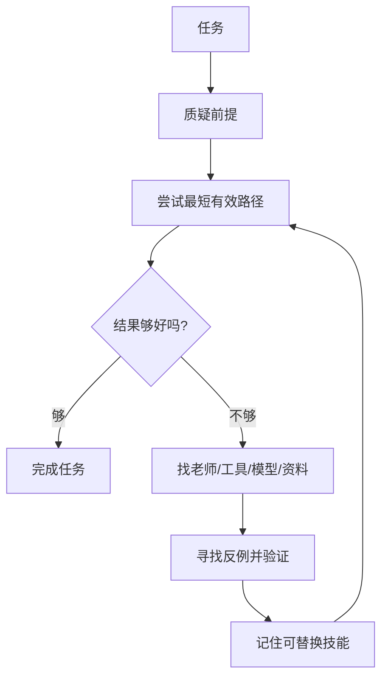

# AI-Apprentice

> 不要造一个什么都知道的 AI。造一个永远不会停止学习的 AI。

AI-Apprentice 是一个本地优先的个人 AI 学徒框架。它的目标不是把一个模型包装成“万能答案机”，而是让 AI 在使用过程中持续学习：质疑前提、观察、请教、寻找反例、验证、提炼技能、记住，下次做得更好。

一句话：

> 你的 AI 不一定要什么都知道，但它必须知道怎么学习。

## 为什么做这个

现在很多 AI 工具都是这样：

1. 你问一次。
2. 它答一次。
3. 聊天结束。
4. 明天又从头开始。

AI-Apprentice 想解决的是“不会积累”的问题。

如果一个 AI 今天去 ChatGPT 学会一种思考方式，去 Qwen 学会一种中文聊天技巧，去 DeepSeek 学会一种翻译风格，去文档里学会一个工具用法，它不应该只是复制答案，而应该把这些经验提炼成自己的技能。

这就是“AI 学徒”的意思。

## 学习循环



## 这个项目适合谁

- 想做个人 AI Agent 的人
- 想让本地 AI 不断进步的人
- 想把多个模型的优点吸收成自己体系的人
- 想做 AI 学习框架、插件、工具链的人
- 想做一个容易让 GitHub 用户看懂并参与的开源项目的人

## 当前内容

这个仓库现在先从最小可运行版本开始：

- 一个离线 learning loop demo
- 一个简单的 skill memory
- 一个翻译学习例子
- 项目理念文档
- 路线图和贡献指南

运行 demo：

```bash
python examples/translation_loop.py
```

运行测试：

```bash
python -m unittest discover -s tests
```

## 不是做什么

AI-Apprentice 不是另一个“全能 AI 壳子”。

它也不是简单地把很多模型接在一起，然后每次问一圈。

真正重要的是：

- 先确认真正目标，而不是默认接受过程
- 分清真实限制与习惯形成的前提
- 什么时候知道自己不会
- 去哪里找老师
- 怎么主动寻找反例，判断老师说得对不对
- 怎么把事实、推理和不确定分开
- 怎么把一次经验变成可验证、可替换的技能
- 怎么让下一次走更短的路

## 路线

第一阶段：把概念讲清楚，做出可运行 demo。

第二阶段：加入本地模型、API 模型、浏览器、文件、语音/视觉等观察能力。

第三阶段：让 AI 可以为用户建立长期技能库，逐渐变成一个适合个人的 AI。

第四阶段：让技能可以在 Agent 之间传播，但每个接收者都必须重新验证，避免错误经验扩散。

更详细路线见 [docs/roadmap.md](docs/roadmap.md)。

## 新原则

> 没有规则是永久的。每条规则都必须可以验证、替换和回滚。

这里说的“偷懒”不是少做事，而是寻找抵达目标的最短有效路径：

> 智能不是做更多工作，而是缩短自己与目标之间的距离。

AI-Apprentice 不只会学习。它还要会怀疑自己学到的东西，并在发现更好的可靠路径时主动替换旧规则。

## 开源口号

Don’t build an AI that knows everything.

Build one that never stops learning.
